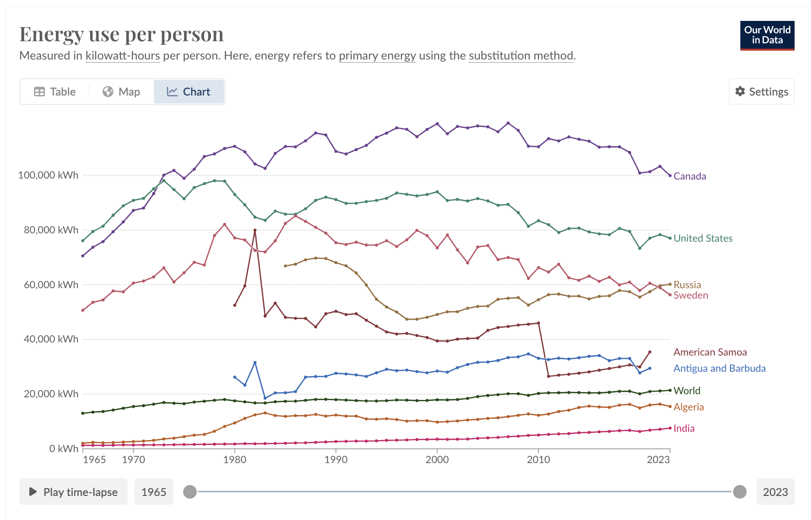

# Data Visualization Critique and Redesign

## Introduction
For this assignment, I selected a data visualization from [Our World in Data: Primary Energy Consumption per Capita](https://ourworldindata.org/grapher/per-capita-energy-use?tab=chart&time=earliest..2023&country=IND~SWE~OWID_WRL~USA~CAN~RUS~ATG~ASM~DZA). The aim was to critique the visualization using Stephen Few's Data Visualization Effectiveness Profile and then redesign it using Tableau.

## Original Visualization
 
**Title:** Primary Energy Consumption per Capita  
**Source:** Our World in Data

### Why I Selected This Visualization
I chose this visualization because it provides a overview of per capita energy consumption from 1965 to 2023 across different countries. The topic is relevant for researchers, policymakers, and students studying global energy trends, making it an excellent candidate for critique and potential improvement.

## Critique using Stephen Few's Data Visualization Effectiveness Profile
In this section, I used Stephen Few's Data Visualization Effectiveness Profile to assess the visualization on various aspects. Below is a summary of my observations:

### **Usefulness:** 6/10
- The chart communicates long-term energy consumption trends effectively.
- However, it lacks contextual markers and factors influencing the data, limiting its usefulness for deeper analysis.

### **Completeness:** 5/10
- While the basic information (energy consumption over time) is present, the chart lacks additional context, such as the impact of GDP, policy changes, and energy sources.
- The visualization does not provide explanations for significant changes in trends.

### **Perceptibility:** 5/10
- The cluttered and overlapping lines make it difficult to distinguish trends, especially when many countries are selected.
- The heavy reliance on color can be problematic for those with color vision deficiencies.

### **Truthfulness:** 7/10
- The data presented appears accurate, but the title "Energy Use Per Person" is somewhat misleading. It suggests individual consumption when it represents average per capita use across all sectors.
- The fixed y-axis scale can obscure differences among countries with lower energy consumption.

### **Intuitiveness:** 6/10
- While the play-time-lapse feature provides some dynamism, the visualization lacks clear instructions or guidance on how to interpret trends.
- The use of country labels is clear, but it could be further improved with annotations.

### **Aesthetics:** 6/10
- The visualization is somewhat pleasing to look at, but the clutter detracts from its beauty. Simplifying the design could improve its aesthetics.

### **Engagement:** 5/10
- The visualization has the potential to draw viewers in, but the lack of context and clarity can hinder further exploration.

## Overall Observations
The visualization effectively provides a historical overview of global energy consumption per capita. The time-lapse feature and the ability to add or remove countries make it somewhat interactive. However, it suffers from clutter, overlap, reliance on color, and a misleading title, which reduce its overall effectiveness. 

### What I Would Do Differently
- Use cumulative average data to reduce clutter and improve comparability.
- Employ a diverging color palette and bar graph to address accessibility issues.
- Realign axes, countries on x-axis and the energy mesasure on y-axis
- A clearer title and country codes instead of long names.

## Redesign Plan
For the redesign, I created a horizontal bar chart wireframe that displays the average energy consumption per country from 1965 to 2023. This chart allows for a clear comparison of energy consumption across countries, avoiding the clutter of a line chart with overlapping lines. By sorting the countries in descending order, the chart makes it easier to identify the top energy-consuming nations at a glance.

<noscript></noscript><object class='tableauViz'  style='display:none;'><param name='host_url' value='https%3A%2F%2Fpublic.tableau.com%2F' /> <param name='embed_code_version' value='3' /> <param name='site_root' value='' /><param name='name' value='critique_by_redesign&#47;AverageEnergyConsumptionpercountry1965to2023' /><param name='tabs' value='no' /><param name='toolbar' value='yes' /><param name='static_image' value='https:&#47;&#47;public.tableau.com&#47;static&#47;images&#47;cr&#47;critique_by_redesign&#47;AverageEnergyConsumptionpercountry1965to2023&#47;1.png' /> <param name='animate_transition' value='yes' /><param name='display_static_image' value='yes' /><param name='display_spinner' value='yes' /><param name='display_overlay' value='yes' /><param name='display_count' value='yes' /><param name='language' value='en-US' /><param name='filter' value='publish=yes' /></object>
                

**Source: [Our World in Data: Primary Energy Consumption per Capita](https://ourworldindata.org/grapher/per-capita-energy-use?tab=chart&time=earliest..2023&country=IND~SWE~OWID_WRL~USA~CAN~RUS~ATG~ASM~DZA) **

The wireframe includes:
- A title that clarifies the timeframe and the metric: "Average Energy Consumption per Country (1965 to 2023)."
- Horizontal bars representing each country's average energy consumption in kilowatt-hours per person.
- A consistent x-axis scale to ensure fair comparisons between countries.

This new format addresses the issues of clutter and overlap in the original visualization while using an accessible layout.

## Testing the Solution
I shared the redesigned bar chart with two individuals to gather their insights. Here is the feedback, distributed across both interviewees:

#### **Interviewee 1: Student, mid-20s**
- **What Worked:**
  - **Clear Top Countries:** Found that the bar graph format made it easier to identify the countries with the highest per capita energy consumption. The horizontal layout provided a straightforward way to compare between nations.
  - **Stable Metric:** Liked the use of average energy consumption per person over the entire timeframe, as it gave a clear basis for comparison and eliminated the clutter seen in time-series line charts.
- **What Didn’t Work:**
  - **Country Codes:** Found the use of country codes (e.g., "VIR," "ANT") confusing. Recommended using full country names for better clarity, as abbreviations made it harder to identify each country at a glance.
  - **Too Many Countries:** Pointed out that the number of countries made the chart very long and overwhelming. Suggested focusing on the top 20 countries to make the visualization more digestible and focused.
- **Questions Raised:**
  - "Is it necessary to include every country in this chart, or could it be more effective to highlight just a few?"
  - "Can the data be broken down by region to make the comparison easier?"
- **New Inspirations:**
  - Suggested adding a regional segmentation, grouping countries by continents to reveal global patterns more clearly.
  - Proposed changing the unit of measurement to something more relatable, such as "number of household appliances powered per person annually."

#### **Interviewee 2: Adult, late-50s**
- **What Worked:**
  - **Horizontal Bars:** Appreciated the use of horizontal bars, stating that it made cross-country comparisons clearer and was easier to interpret than the original line chart.
  - **Top Country Identification:** Noted that the new format provided a clearer view of which countries had the highest energy consumption per person.
- **What Didn’t Work:**
  - **Color Use:** Critiqued the uniform color of the bars, suggesting the use of a gradient or color scale to highlight differences in energy consumption more effectively.
  - **Headline:** Mentioned that the title could be more descriptive and engaging. Proposed changing it to something like "Top 20 Global Leaders in Energy Consumption Per Person (1965–2023)" to draw in the audience, Also the X-axis label "Code" was unclear.
- **Questions Raised:**
  - "Could you change the unit to something more tangible, like 'average household energy consumption per person,' to make it more relatable?"
- **New Inspirations:**
  - Thought of the possibility of adding annotations to highlight key countries, explaining why they have higher or lower energy consumption.
  - Recommended using a race bar graph to show the changes in consumption over time, although acknowledged that this might be difficult to implement in Tableau.

#### **Summary of Feedback**
Both interviewees appreciated the switch to a bar chart for its clarity and ease of comparison. However, they pointed out areas for improvement, such as replacing country codes with full names, enhancing the color scheme, limiting the number of countries shown, and using a more engaging title. They also raised questions about regional breakdowns and using more relatable units of measurement, inspiring potential modifications for the final redesign.

## Building the Solution in Tableau

<noscript></noscript><object class='tableauViz'  style='display:none;'><param name='host_url' value='https%3A%2F%2Fpublic.tableau.com%2F' /> <param name='embed_code_version' value='3' /> <param name='site_root' value='' /><param name='name' value='critique_by_redesign_updated&#47;AverageEnergyConsumptionpercountry1965to2023' /><param name='tabs' value='no' /><param name='toolbar' value='yes' /><param name='static_image' value='https:&#47;&#47;public.tableau.com&#47;static&#47;images&#47;cr&#47;critique_by_redesign_updated&#47;AverageEnergyConsumptionpercountry1965to2023&#47;1.png' /> <param name='animate_transition' value='yes' /><param name='display_static_image' value='yes' /><param name='display_spinner' value='yes' /><param name='display_overlay' value='yes' /><param name='display_count' value='yes' /><param name='language' value='en-US' /><param name='filter' value='publish=yes' /></object>
                

**Source: [Our World in Data: Primary Energy Consumption per Capita](https://ourworldindata.org/grapher/per-capita-energy-use?tab=chart&time=earliest..2023&country=IND~SWE~OWID_WRL~USA~CAN~RUS~ATG~ASM~DZA) **

For my final redesign, I made several changes to make the data visualization more relatable, accessible, and insightful while retaining its exploratory nature. Here’s an overview of the redesign process, choices I made, and the final outcome:

### 1. Updated Metric to Layman Terms
- I decided to convert the original energy consumption metric (kWh) into something more relatable for a general audience: **"Phone Charges per Person."**
- The new metric is based on the assumption that **1 kWh = 200 phone charges**, making it easy for viewers to grasp the concept of energy usage in terms of something they interact with daily.
- This change is reflected in the axis label: **"Phone Charges / Person [1 kWh = 200 phone charges]"**, providing clear information about the conversion used.

### 2. Included the Entire Dataset
- I opted to include all the countries in the dataset rather than limiting it to a top 25 list. 
- This decision keeps the visualization exploratory, allowing viewers to identify disparities in energy consumption across a diverse set of countries. This choice makes the data more informative, giving a broader perspective on global energy consumption.

### 3. Use of Color
- I chose a **gradient of green** for the bars to make the chart both aesthetically pleasing and contextually relevant. The gradient starts with a dark green for the highest values, transitioning to a lighter green for lower values.
- The choice of green aligns with the new unit of measurement, "Phone Charges," providing a subtle nod to the association between smartphones and energy consumption.
- The gradient also helps visualize the disparity in consumption across countries at a glance, allowing viewers to easily distinguish which countries have the highest average energy usage.

### 4. Displaying Labels for Accessibility
- I added the numerical values of "Phone Charges" to the end of each bar, enhancing accessibility. This feature allows viewers to see the exact numbers without having to hover or refer to the axis.
- This improvement ensures that the data is clear and understandable, especially for those who may have difficulty interpreting the relative length of the bars alone.

### 5. Chart Title and Subtitle
- I revised the title to a more engaging and relatable form: **"Energy Hogs: How Much Power on Average Does a Person Use in a Year?"** This title piques curiosity and directly addresses the theme of per capita energy consumption.
- The subtitle adds necessary context: **"(Measured by Phone Charges, Ranked by Country)"**, helping viewers immediately understand the conversion and the chart’s scope.

### 6. Layout and Axis Adjustments
- The X-axis was relabeled to clearly state the unit of measurement, highlighting the conversion for clarity: **"Phone Charges / Person [1 kWh = 200 phone charges]"**.
- The bar lengths and gradients effectively showcase the disparities in energy consumption among the countries, with the larger bars quickly drawing attention to the highest consumers.

### Rationale for Design Choices
- **Relatable Metric:** By using "Phone Charges," I aimed to transform an abstract concept (kWh) into something the average person can easily understand, making the data more engaging.
- **Exploratory Nature:** Including all the countries provides a comprehensive look at global energy disparities, allowing viewers to explore patterns and anomalies on their own.
- **Visual Appeal:** The green color scheme is not only pleasing but contextually linked to the "phone charges" theme, creating a unified, intuitive visual narrative.

### Final Outcome
- The final chart is an accessible, informative, and aesthetically pleasing visualization that allows for quick comparisons and explorations of global energy consumption per person.
- By converting energy consumption into phone charges, using a gradient color scheme, and providing clear labels, I created a visualization that effectively communicates the disparities in energy use in a way that is easy to grasp for a broad audience.

### Next Steps
- While the current chart provides a comprehensive overview, future iterations could include interactivity, such as filters by region or income group, to allow for even more detailed exploration of the data.

This redesigned chart successfully addresses the critiques from the earlier assessment, making it more user-friendly, informative, and engaging.
