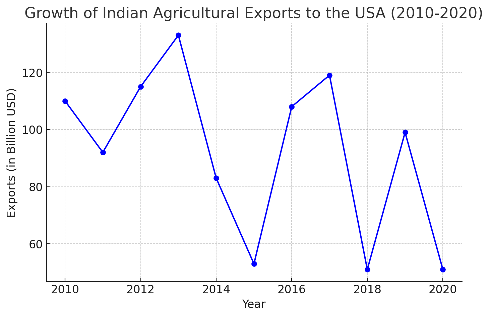
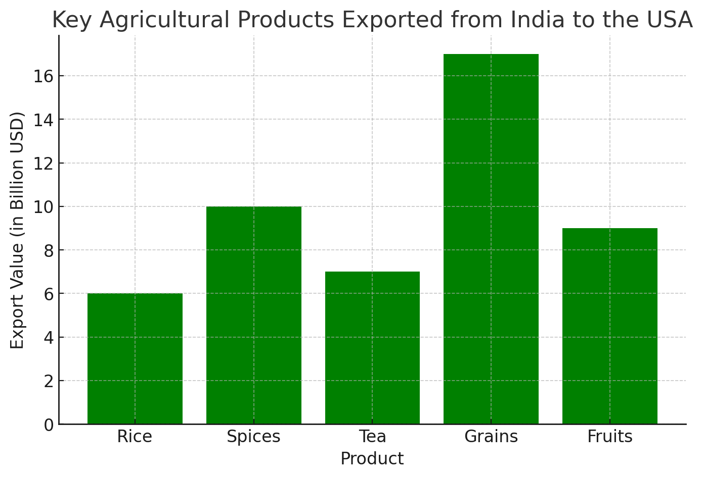
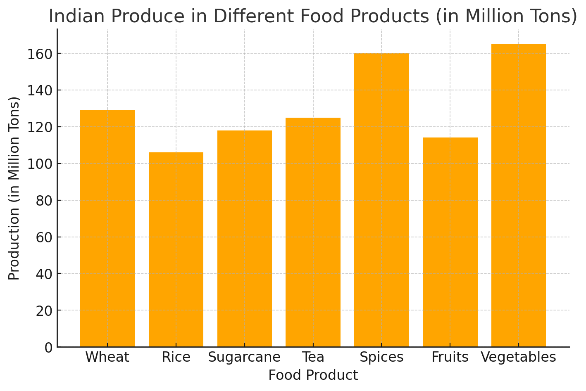

# Overview: The Growing Demand for Indian Food Products in the USA

## From Fields to Foreign Shelves 🌾

This project explores the rising trend of Indian agricultural products finding their way to the shelves of U.S. stores and the benefits that come back home to India's agricultural backbone. Indian farmers, long considered the lifeblood of the nation’s economy, are now positioned to capitalize on this growing demand abroad. But it's more than just exports—it's an opportunity to strengthen India’s farming community.

## Cultivating Global Demand 🌍

Through data, I’ll demonstrate how the surge in Indian agricultural imports in the U.S. is creating a new global market for India’s farmers. We’ll look at how this increasing demand provides economic growth, empowers local farmers, and promotes sustainable agricultural practices. The story will highlight how this global demand is not just about selling more products—it’s about investing in India's future and ensuring that its farming legacy thrives.

## A Win-Win Harvest 💡

I intend to tell a story for the major employment base in my home country India, agriculturalists, i.e, farmers. Telling this story through data, I will implore my viewers on the need to make use of this rising opportunity of increasing Indian diaspora in the United States of America which is backed the increase in demand for agricultural products - sourced in India. By the end of this project, I hope to show how rising imports of Indian agricultural products in the U.S. create a win-win situation: one where American consumers benefit from quality, diverse products, and Indian farmers reap the rewards of global trade. It’s time to celebrate the connection between local farmers and global markets, and how this relationship helps India's agricultural sector flourish.

# Project Structure: Rising Indian Agricultural Exports to the USA

## 1. Introduction & Context
- **Hook**: Set the stage by introducing the rising trend of Indian agricultural products being imported into the U.S., focusing on the global demand and the critical role Indian farmering interests.
- **Create Tension**: Begin with an engaging statistic or visual showing the current landscape of Indian agriculture, then gradually introduce the U.S. market's growing demand. Encourage speculation on how these two trends connect.

## 2. Building the Narrative
- **Show the Chart and Stop Talking**: Use a simple, clear visualization comparing the growth of Indian agricultural exports to the U.S. over the past decade. Let the chart speak for itself, allowing the audience to engage visually without excessive explanation.
- **Conflict/Tension**: Present the challenges Indian farmers (agricultual exports contibution to Indian GDP) in a way that contrasts with the growing opportunity in the U.S. market.
- **Don’t Read the Picture**: When presenting visuals, focus on the insights they reveal—such as the potential for Indian farmers to benefit from U.S. demand—rather than over-explaining the chart structure.

## 3. Rising Opportunity
- **Guide the Audience**: Using unusual visual forms (e.g., bubble charts, heat maps), briefly guide the audience on how to read them, but immediately shift to discussing the important takeaways—like the most exported products from India to the U.S. and their impact on the Indian economy.
- **Use Reference Charts**: Pair the viewer main chart with reference charts that show "ideal" or "average" cases, such as the the increasing demand for indian cusisines and restaurants, demand for food products sourced in India, to give the viewerr audience a clear comparative understanding.

## 4. India’s Agricultural Backbone
- **Deconstruct and Reconstruct**: Break down the export data into simpler categories (e.g., regions, crops) and then rebuild it into a comprehensive view of how this trend strengthens India's agricultural backbone.

## 5. Call to Action
- **Tell Stories**: Use data to back up this narrative, weaving in the larger story of how the U.S. demand is increasing over the years and is backed by the increasing Indian diaspora in the USA.
- **Create Tension & Use Time**: As the viewer moves toward the resolution, build anticipation by showing incremental changes over time in exports and investing benfits. Let the final visual land with a compelling call to action: encouraging investment in Indian agriculture and promoting sustainable export growth.

# Intial Sketches
 I made use of python scripts with mock data to get a visualization close to what I intend acheive at the end, the following are the mock visualization for my project

### Line Chart:
This chart shows the growth of **Indian agricultural exports to the USA** from 2010 to 2020. It highlights the fluctuations in export volumes over the years, providing a clear view of the trends in Indian exports and their impact on global trade.

### Bar Chart:
This visualization compares the **key agricultural products exported from India to the USA**. It showcases export values (in billion USD) for items such as **Rice, Spices, Tea, Grains, and Fruits**, giving insights into which products dominate the export landscape.

### Pie Chart:
The pie chart displays the **market share of key agricultural products exported from India**. It provides a percentage breakdown of each product's share, with **Rice** taking the largest slice of the pie, followed by **Spices** and other key products.

### Indian Produce in Different Food Products:
This bar chart shows **Indian produce in different food products**, represented in million tons. It provides context for the types of agricultural products India produces, including items like **Wheat, Rice, Sugarcane, Tea, Spices, Fruits, and Vegetables**. This data can be linked to the products being exported to the USA, demonstrating India's agricultural capacity.

# Data Sources

## Agricultural Imports Data (USDA)
The primary dataset we are using is from the **United States Department of Agriculture (USDA)**, which provides detailed records of agricultural imports by country and product category. This dataset will allow us to track the volume and type of agricultural products being imported into the United States from India over the past years. This is essential for demonstrating the rise in Indian agricultural exports to the U.S. and quantifying the economic impact on India's agricultural backbone.

- **Data Source 1**: [USDA](https://www.ers.usda.gov/data-products/foreign-agricultural-trade-of-the-united-states-fatus/)
- **Data File 1**: [country_trade.xlsx](country_trade.xlsx)

## Pew Research Center Data on Indian Americans
To provide additional context to the rising demand for Indian agricultural products, we are utilizing data from the **Pew Research Center** on the growing Indian American population. This dataset offers insights into the demographic growth of Indian Americans, which can help explain the increase in demand for Indian agricultural products in the U.S. market.

- **Data Source 2**: [Pew Research Center: Asian Americans, Indians in the U.S.](https://www.pewresearch.org/fact-sheet/asian-americans-indians-in-the-u-s/)
- **Data File 2**: [Pew Data](Pew-data.csv)

## USDA Report on Growing U.S. Agricultural Exports to India
This report from the **USDA** provides valuable insights into the agricultural trade between the U.S. and India, specifically focusing on the growing opportunities for U.S. exports into India. While this data highlights the reverse trade relationship, it complements our narrative by showcasing this rising opportunity for Indian farmers.
- **Data Source 3**: [2017-10_iatr_india.pdf](2017-10_iatr_india.pdf)

# Method and Medium

For this project, I will be using **Shorthand** to structure the storytelling elements, creating an interactive narrative that engages the audience and enhances the data-driven story. This platform will allow me to present the context and call-to-action seamlessly within a visually compelling layout. 

Additionally, all **data visualizations** will be created using **Tableau**, ensuring that the graphs and charts are dynamic, interactive, and easy to explore. Tableau will be used to create line charts, bar charts, and pie charts that show the growth of Indian agricultural exports to the USA, key product comparisons, and the impact on the Indian agricultural economy.

By combining Shorthand for storytelling and Tableau for interactive data visualizations, the final project will deliver a comprehensive and engaging story about the rise in Indian agricultural exports and the rising opportunities for Indian farmers.

